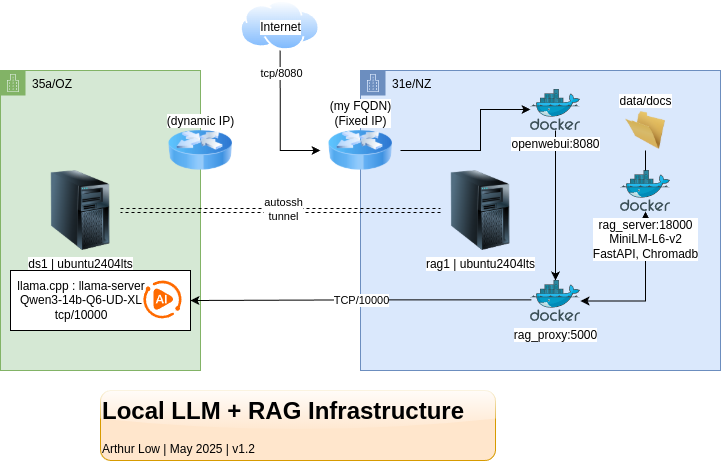

## 📝 Technical Design Document: RAG System (Personal LAB)

### 1. Overview

**Project Name**: LocalLLM RAG System (Personal Lab).

**Objective**: Build a minimal but functional RAG-based QA system using Qwen-14B and a lightweight backend.  

**Target Audience**: Developers, AI Architects, MLOps Engineers  

---

### 2. Architecture Diagram

- User → Frontend → FastAPI → Chroma (retrieval) → Qwen (generation)

**Infrastructure**

**Hardware Specs**
| Host | Function | GPU | Hardware | OS |
|------|----------|-----|----------|----|
| ds1 | Local LLM | Geforce RTX 4060 16GB VRAM | AMD Ryzen 5 5500, Gigabyte B550M DS3H AC, Lexar SSD NM790 2TB, 64GB RAM | Ubuntu2404LTS |
| rag1 | UI + RAG | - | AMD Ryzen 5 5500, Asus PRIME B550M-K, Kingston SNV2S1000G 1TB, 32GB RAM | Ubuntu2404LTS |

---

### 3. Component Breakdown

| Service | Function | Description |
|---------|----------|-------------|
| rag_server | Document Loader | Uses `UnstructuredFileLoader` to read input files |
| rag_server | Text Splitter | `RecursiveCharacterTextSplitter` for semantic chunking |
| rag_server | Embedding Model | `sentence-transformers/all-MiniLM-L6-v2` |
| rag_server | Vector Store | Chroma for CPU-friendly vector DB |
| rag_proxy | Retrieval API | FastAPI endpoint to serve similarity search |
| rag_proxy | Query Agent | Combines retrieval + generation |
| localLLM | LLM Generator | Qwen-14B via llama.cpp/llama-server |
| openwebui | Webfront chat | OpenWebUI |

---

### 4. Data Flow

1. User submits query via webfront chat
2. Query hits `/retrieve` endpoint
3. Vector store returns top-k similar chunks
4. Query agent formats prompt with context
5. LLM generates final answer
6. Response returned to user

---

### 5. Trade-offs & Considerations

| Decision | Why |
|--------|-----|
| Chroma over FAISS | Simpler to set up locally; no extra indexing needed |
| Sentence Transformers | Lightweight and works well with CPU |
| No cloud hosting | Entirely local for security and privacy use cases |
| Sync over async API | Simpler implementation for MVP |

---

### 6. Scaling Considerations

- Add caching layer for repeated queries
- Replace Chroma with Weaviate or Pinecone for scalability
- Use Redis for context caching
- Containerize services with Docker
- Kubernetes for orchestration at scale

---

### 7. Improvements in progress

- Add evaluation metrics (faithfulness, relevance)
- Support more document types (Markdown, Word, etc.)
- Implement logging and monitoring
- Add prompt engineering guardrails
- Explore LoRA fine-tuning for domain-specific answers

---
